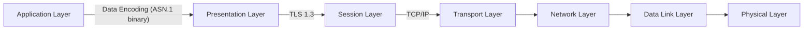

# 104781 - Cyber Security - Lab Session (04)

## Implementing TLS 1.3 Client from Scratch

> [!Note]
> You can complete this task in pairs! **But not in larger groups**. Remember to mention your pair. The workload assumes that you have friendly LLMs available, such as ChatGPT, [Phind](https://www.phind.com) or [GitHub Copilot](https://docs.github.com/en/copilot/quickstart). Especially GitHub Copilot is useful for this task, so this is a good chance to try it out.

> [!Note]
> You can work on this task until the end of the course, if you want to, but it is recommended to do in time.

> You can fully focus on this task to get up to 9 points by doing it carefully. But be warned, getting a maximum grade requires a lot of work. If you want to skip the coding, you have another path with similars goals on task 3 and task 4.

Implementing network protocols correctly can be *hard*. They are typically complex and work in a binary, non-text format.
This is because of the performance reasons, error correction and the minimized addition of overhead to the total bandwidth usage. They must follow strict standards to be compatible with different hardware and software systems.
Protocols must be designed to handle arbitrary data and then parse and process them correctly while doing it fast. They must be fault-tolerant if they encounter incorrect data.

> A huge part from the all security problems are related to faulty implementations of these protocols, or incorrect use of them.

If we look at the network OSI model structure, we can see many different protocols on different layers for different purposes.
In the following example graph, the application is transmitting ASN.1 binary encoded data as TLS 1.3 encrypted over TCP/IP protocol.

All of the protocols are complex, but they share similar efficiency and robustness requirements while having different goals.

 * ASN.1 encodes the application-specific data compactly to be suitable for the usage and parsing of other applications. (Compare it to more efficient  JSON)
 * TLS 1.3. encrypts the session data so that it cannot be eavesdropped on or modified, while also giving sufficient guarantees that the data goes to the intended party.
 * TCP/IP carries the data to the destination over some network in an IP address space with some reliability guarantees.

To demonstrate the complexity and process of doing them correctly and *maybe even more securely*, we will implement the handshake part of the TLS 1.3 protocol standard as a minimal client.

This should also make you more familiar with what it takes to transmit encrypted data over an insecure line so that it might even go to the correct destination, efficiently with binary protocols.

> [!Important]
> **This is for educational purposes only. In general, you should not write your TLS library yourself on byte level.**

### TLS 1.3 Handshake Protocol

* [RFC 8446](https://datatracker.ietf.org/doc/html/rfc8446)
    * Provided ASN.1 notations about data structures are super useful when implementing the client. Especially, if one consults a friendly LLM. *The Rust Starter project has already most of them.*
    * You *will need to* read this standard to understand the protocol.

* Transport Layer Security [in Wikipedia](https://en.wikipedia.org/wiki/Transport_Layer_Security)

A small background [blog](https://blog.cloudflare.com/rfc-8446-aka-tls-1-3) about the major changes compared to previous versions.

In conclusion, TLS 1.3 is much simpler compared to previous versions and supports only a limited amount of cipher suites (only the strong ones).

For the purpose of this task, it should be doable, and can give us a glance at what protocols could be!

To get a good overview of the standard and the handshake process at the byte level, check [https://tls13.xargs.org](https://tls13.xargs.org).
[The provided Rust project](https://github.com/ouspg/tls13tutorial/) will help the implementation of other programming languages too, if you decide so.

During the handshake, both the client and server agree on the cipher suite as follows.

* Key exchange mechanism (e.g., ECDHE for elliptic curve Diffie-Hellman ephemeral)
* Signature algorithm (e.g., RSA, ECDSA)
* Symmetric encryption algorithm (e.g., AES-GCM, ChaCha20-Poly1305)
* The hash function for message authentication and PRFs (e.g., SHA-256)

The priority and availability of the cipher suites are pre-defined for the task.

### Implementation requirements

> [!Important]
> You should implement *a client*, with minimal working features to complete TLS 1.3 handshake, while also noting the error handling. Or more, if you decide so, to replace other tasks from this week.

Minimal TLS client implementation includes the completion of the handshake process with the following features:
  * Key exchange with X25519 and signatures with EdDSA (Elliptic Curve Diffie-Hellman key exchange using Curve25519 and Edwards-Curve Digital Signature Algorithm based on the same curve).
  * ChaCha20-Poly1305 as a symmetric algorithm and cipher suite.
  *  In TLS 1.3, the use of certain extensions is mandatory
  * Mandatory extensions as specified [here.](https://datatracker.ietf.org/doc/html/rfc8446#section-9.2) The sample Rust project has most of them implemented with `as_bytes` mapper. You can also get a good overview of the extensions required by the client from the visualization of https://tls13.xargs.org.
  * At least `cloudflare.com` and `google.com` support the above ciphers for testing purposes.
  * You can and *should* use Wireshark to debug your implementation.

Note that the protocol follows mostly the *tag-length-value* principle.
There can be constraints for the size of the tag or length, and **this defines how many bytes the tag or length can take**, while the length itself then defines the number of subsequent bytes.

[The sample project](https://github.com/ouspg/tls13tutorial/) provides the *encoding* part for the above, but not the *decoding* part, other than a couple of partial examples. Decoding means mapping arbitrary binary data to correct data structures. This is the part where the typical security problems arise and you should focus on.
